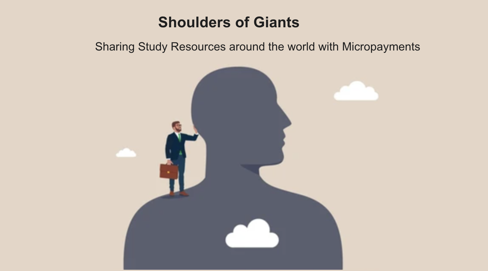

<h4 align="center">
  <a href="[[https://www.youtube.com/watch?v=dkONR9dJD2](https://youtu.be/_jF8Wi2imgY)](https://youtu.be/_jF8Wi2imgY)">Video Walkthrough</a>
</h4>

__This is a solo Hackathon project for the EthGlobal Brussels 2024.__

**Seamless Micro-Transactions for Gated Access to View University Study Resources**

🧪 Studying Science at University can be challenging—impossible without comprehensive solutions that lecturers don't like to share. Acknowledging that we all stand on the 'shoulders of giants, ' students from all around the world share solutions for free on the internet. As beautiful as this is, running a personal website with solutions is not free, nor is the effort of publishing.

Publishers of study materials should get rewarded. Third-party platforms exist, yet they take a big cut. Further, student bodies can be very international, and a Chinese student may learn from someone in Europe and vice versa. Payments get difficult or impossible if they are small.

To solve this, we set out to enable micropayments to access my university resources on my webpage - as a minimal viable product. This solved the issue of small payments across the planet.

Further down the line, session keys should allow a seamless experience to pay per view of a file without signing any transactions. This way, the user would not have to worry about the quality of the content.

This project used the dynamic wallet from @dynamic-labs to handle all wallet interactions and allow for easy onramp. 

For demonstration purposes, a user may mint an access NFT via an ERC721 contract deployed on BaseSepolia for 0.001 ETH.

Via dynamic's implementation of gated access via NFTs, we restrict the view of the study materials on the webpage.

## Requirements

Before you begin, you need to install the following tools:

- [Node (>= v18.17)](https://nodejs.org/en/download/)
- Yarn ([v1](https://classic.yarnpkg.com/en/docs/install/) or [v2+](https://yarnpkg.com/getting-started/install))
- [Git](https://git-scm.com/downloads)

- You have to get a [Pimlico API key](https://dashboard.pimlico.io/sign-in) and put it in your env file (`NEXT_PUBLIC_PIMLICO_API_KEY`).

- You should send some ERC20 (USDC is better) to your Safe smart wallet in order to use the transfer and cross-chain transfer capabilities.

- You can use the default Dynamic environment ID to test, but we recommend you add your own as soon as possible in the env file (NEXT_PUBLIC_DYNAMIC_ENVIRONMENT_ID)

## Quickstart

To get started with Scaffold-ETH 2 Hacker Edition, follow the steps below:

1. Clone this repo & install dependencies

```
git clone https://github.com/dynamic-labs/hackathon-starter-kit
cd hackathon-starter-kit
yarn install
```

2. Run a local network in the first terminal:

```
yarn chain
```

This command starts a local Ethereum network using Hardhat. The network runs on your local machine and can be used for testing and development. You can customize the network configuration in `hardhat.config.ts`.

3. On a second terminal, deploy the test contract:

```
yarn deploy
```

This command deploys a test smart contract to the local network. The contract is located in `packages/hardhat/contracts` and can be modified to suit your needs. The `yarn deploy` command uses the deploy script located in `packages/hardhat/deploy` to deploy the contract to the network. You can also customize the deploy script.

4. On a third terminal, start your NextJS app:

```
yarn start
```

Visit your app on: `http://localhost:3000`. You can interact with your smart contract using the `Debug Contracts` page. You can tweak the app config in `packages/nextjs/scaffold.config.ts`.


## Tech Stack

⚙️ Built using NextJS, Dynamic, Hardhat, Wagmi, Viem, and Typescript.
- 🤝 **Dynamic onboarding**: Provides an interactive and responsive widget for interacting with your embedded wallet. You can create your embedded wallet using social logins or connecting an existing wallet.
- 🔥 **Safe Smart Wallet**: Provides the most battle-tested ERC-4337 compatible smart wallet, improving users' UX.

## Forked From
- [🏗 Scaffold-ETH 2 (Hackathon Starter Kit Version)](🏗 Scaffold-ETH 2 (Hackathon Starter Kit Version))


## Further Documentation
- [Dynamic](https://docs.dynamic.xyz/)
- [Original Scaffold Eth 2](https://scaffold-eth-2-docs.vercel.app/)
- [Pimlico](https://docs.pimlico.io/)
- [Safe](https://docs.safe.global/)
- [Chainlink](https://docs.chain.link/)
- [Blockscout](https://docs.blockscout.com/for-users/api/rpc-endpoints)
